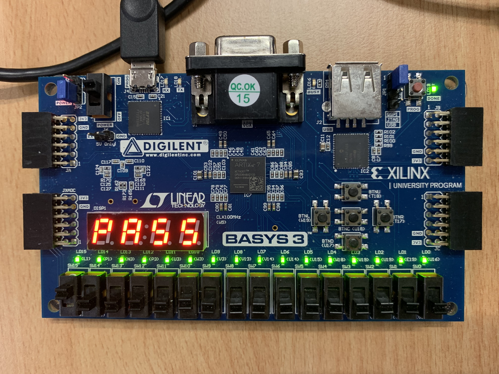
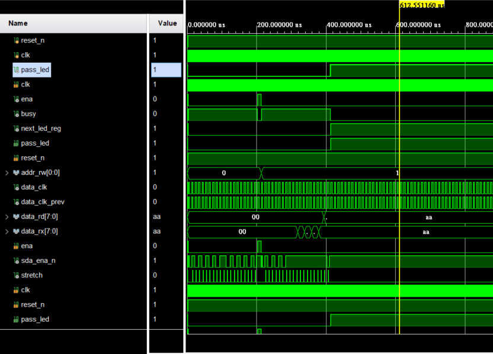

# FPGA實作I2C Master和Slave溝通

## 實作內容
使用I2C通訊方式，實作Master和Slave  
寫入資料後讀取資料 
驗證讀取資料和寫入資料相同: 測試成功  
點亮LED表示測試成功 
並在 7 Segment 顯示PASS 

## 模組
### 上層模組: i2c_top.v
### Master IC: i2c_master.vhd
### Slave IC: I2CTest.v
### PASS顯示模組: seven_seg_display.v

## Testbench
testbench.v

## Basys3 constraint file
Basys3_Master.xdc

## 參考
### I2C Master module
- DigiKey I2C Master VHDL code
- https://forum.digikey.com/t/i2c-master-vhdl/12797
 
